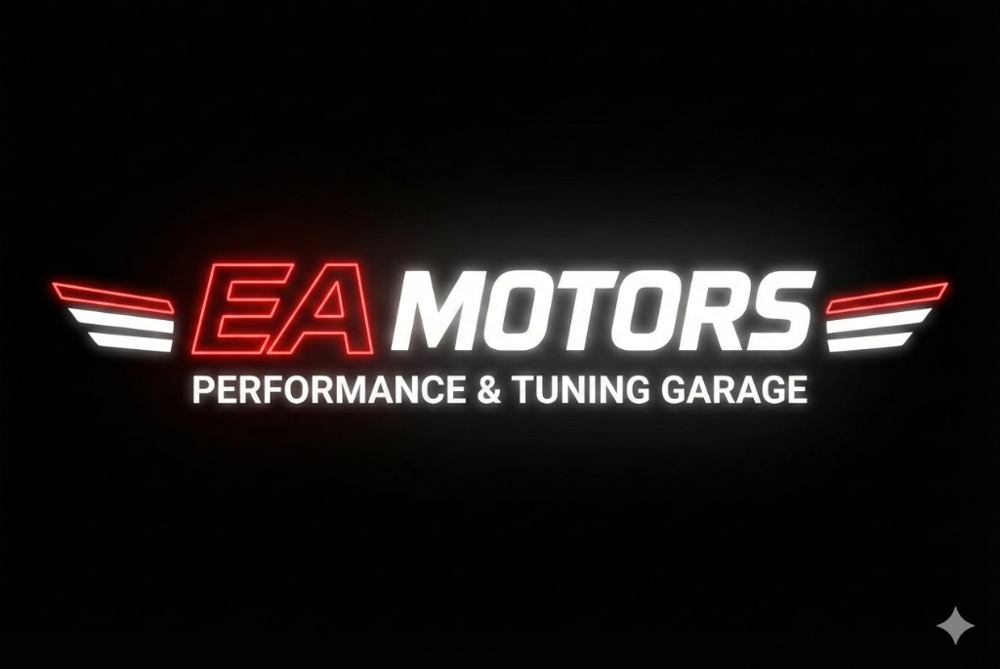

<div align="center">
  <a href="https://github.com/Semikgn/Eamotors.com">
    
  </a>

  <h1>🏎️ EA Motors | Performance & Tuning Garage</h1>
  
  <p>
    <b>Otomotiv sektörü için geliştirilmiş; modern, yüksek performanslı ve kullanıcı deneyimi (UX) odaklı kurumsal web sitesi arayüzü.</b>
  </p>

  <p>
    <a href="https://eamotors-xyz.vercel.app">
      
    </a>
  </p>

  <p>
    
    
    
    
  </p>
</div>

---

## 📖 Proje Özeti

Bu proje, bir araç modifikasyon ve bakım servisi (Tuning Garage) için geliştirilmiş modern bir ön yüz (Frontend) çalışmasıdır. Projenin temel amacı, işletmenin hizmetlerini potansiyel müşterilere en etkileyici şekilde sunmak ve dönüşüm oranlarını (Conversion Rate) artırmaktır.

Tasarımda **"Dark Mode"** estetiği, **Glassmorphism** efektleri ve **akıcı CSS animasyonları** kullanılarak premium bir marka algısı yaratılmıştır.

## ✨ Temel Özellikler

* **🎬 Sinematik Hero Bölümü:** Sayfa açılışında kullanıcıyı karşılayan, CSS overlay ve Glassmorphism teknikleri ile zenginleştirilmiş video arka planı.
* **📱 Tam Responsive (Mobil Uyumlu) Tasarım:** CSS Media Queries kullanılarak mobilden masaüstüne kadar tüm cihazlarda kusursuz görünüm (Liquid Layout).
* **💬 WhatsApp Entegrasyonu:** JavaScript ile geliştirilen, kullanıcıyı tek tıkla ilgili departmana (Satış, Bilgi, Randevu) yönlendiren dinamik mesajlaşma altyapısı.
* **🍔 Özel Mobil Menü:** Standart kütüphaneler yerine, JavaScript ve CSS transition'lar ile sıfırdan kodlanmış, animasyonlu "Slide-in" mobil navigasyon menüsü.
* **🗺️ Özelleştirilmiş Harita:** Google Maps Embed API kullanılarak site tasarımına uygun hale getirilmiş (Invert Filter) karanlık mod harita entegrasyonu.
* **🎨 Modern UI Bileşenleri:** Hover efektleri, Grid ve Flexbox yapıları ile oluşturulmuş servis kartları ve iletişim butonları.

## 🛠️ Kullanılan Teknolojiler

* **HTML5:** Semantik yapı ve SEO uyumlu etiketleme.
* **CSS3:**
    * Flexbox & Grid Layout
    * CSS Variables (Tema yönetimi için)
    * Keyframe Animations & Transitions
    * Backdrop-filter (Bulanıklık efektleri için)
* **JavaScript (ES6+):**
    * DOM Manipülasyonu
    * Event Listeners (Scroll efektleri ve tıklama aksiyonları)
    * Responsive Navigasyon Mantığı

## 🚀 Kurulum ve Çalıştırma

Projeyi yerel ortamınızda çalıştırmak için aşağıdaki adımları izleyin:

1.  **Repoyu klonlayın:**
    ```bash
    git clone [https://github.com/Semikgn/Eamotors.com.git](https://github.com/Semikgn/Eamotors.com.git)
    ```
2.  **Proje dizinine gidin:**
    ```bash
    cd Eamotors.com
    ```
3.  **Çalıştırın:**
    `index.html` dosyasını herhangi bir tarayıcıda açarak projeyi görüntüleyebilirsiniz.

## 📂 Proje Yapısı

```bash
[Eamotors.com/](https://Eamotors.com/)
├── index.html          # Ana HTML yapısı
├── style.css           # Tüm stil ve responsive tanımlamaları
├── script.js           # İnteraktivite ve mantık işlemleri
└── assets/             # Görsel, Video ve Logo dosyaları
    ├── logo.png
    ├── hero_video.mp4
    └── ...
